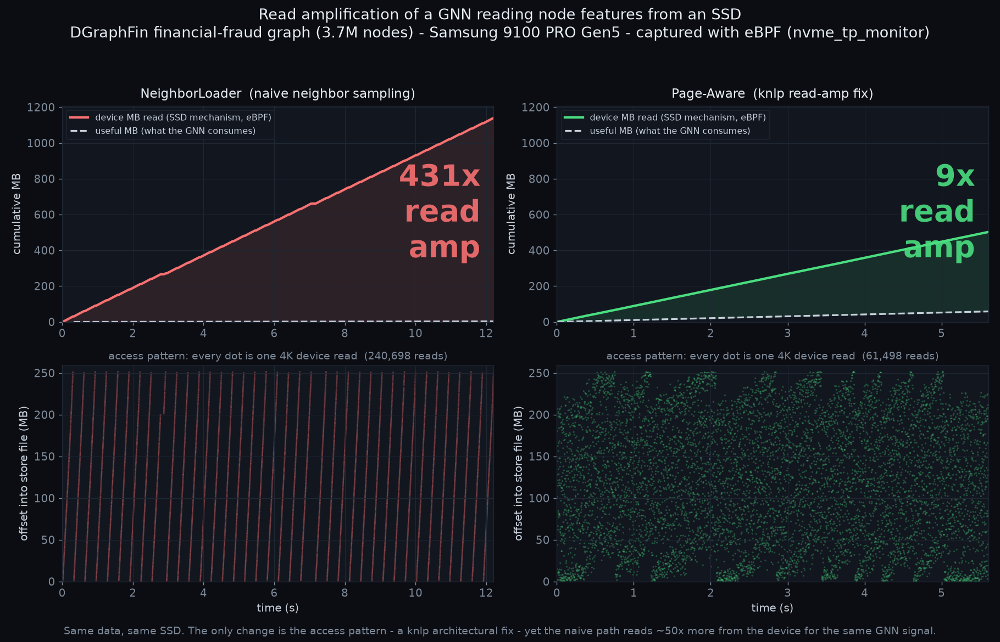

A GNN reads 431× more off the SSD than it needs — watch it, then replay it without the data
===========================================================================================

.. note::

   A styled standalone version of this page (identical content, dark
   theme) is served at `/showcase/gnn-readamp.html </showcase/gnn-readamp.html>`__
   and via htmlpreview from the repository's ``docs/gnn-readamp.html``.

Read amplification of a real financial-fraud graph neural network, captured at the NVMe device layer with eBPF, laid out A/B against the architectural fix, and reproduced from a fio iolog that carries no application data at all. Same tracing stack as the kvio KV-offload work — one layer down, on plain block IO.

dataset **DGraphFin** · 3.7M nodes drive **Samsung 9100 PRO** Gen5 tracer **nvme_tp_monitor** RA **431×** → **8.6×** replay command count **+0.0%**

The gap between two witnesses
-----------------------------

Every storage workload has two witnesses to the same events, and neither tells the whole truth alone. The **application** knows *intent* — "these 2.6 MB of node features are what I actually consume." The **device** knows *mechanism* — "1140 MB of 4 KiB pages crossed the PCIe bus." **Read amplification is the gap between them.**

A GNN that offloads node features to an SSD is the textbook case. Each feature vector is 17 floats — 68 bytes. But storage is paged: a single scattered neighbor drags a whole 4 KiB page for that 68 bytes. Sample a batch of neighbors that land on 240,000 different pages and the device moves a gigabyte to feed a workload that consumes a couple of megabytes. The in-RAM counter can *model* this; eBPF at the nvme tracepoints *proves* it — and here the device-side count matched the store's own read count to the command (240,698 vs 240,698 reads).

**intent witness**

The driver emits its useful feature bytes on a ``CLOCK_MONOTONIC`` axis — what the GNN actually consumes.

**mechanism witness**

``nvme_tp_monitor`` records every device command on the same clock — slba, bytes, completion latency. No ``user_data`` needed; this is plain O_DIRECT block IO.

**the gap is the story**

Lay the two on one timeline and the read amplification is not a statistic — it is the visible distance between two curves.

The A/B: naive access vs the architectural fix
----------------------------------------------

The same features, the same SSD, the same 3.7M-node graph. The only thing that changes is the *access pattern*. **NeighborLoader** samples neighbors and reads each one's page individually. **Page-Aware** batching — a knlp engineering fix — reads pages whole and uses every node on them. That change reduces ``RA_signal`` about 50×, device bytes about 2.3×, and command count about 3.9×. Keep those numbers separate because the page-aware arm also consumes more useful feature bytes. The method generalizes to workloads that offload small useful records inside larger storage units; it does not claim that every GNN or KV cache has this request shape.

   Top: cumulative device MB read (mechanism) against *useful MB the GNN consumes* (intent) — the shaded gap is the amplification. Bottom: every dot is one 4 KiB device read into the 250 MB store file — the naive path sweeps the whole file repeatedly; page-aware is a far smaller, denser cloud.

+----------------------------------------------+-----------------+-------------------------+-----------+----------+
| arm                                          | useful (intent) | device read (eBPF)      | RA_signal | RA_fetch |
+==============================================+=================+=========================+===========+==========+
| **NeighborLoader** — naive neighbor sampling | 2.65 MB         | 1140 MB · 240,698 reads | 431×      | ~57×     |
+----------------------------------------------+-----------------+-------------------------+-----------+----------+
| **Page-Aware** — knlp read-amp fix           | 58.3 MB         | 502 MB · 61,498 reads   | 8.6×      | ~2×      |
+----------------------------------------------+-----------------+-------------------------+-----------+----------+

``RA_signal`` = device bytes / useful feature bytes (vs what the model consumes). ``RA_fetch`` = device bytes / minimal pages needed (the store's own ``ra_physical``: the page-granularity tax even after you account for necessary paging). Both are honest; ``RA_signal`` is the end-to-end number a workload actually pays.

What the Perfetto timeline shows
--------------------------------

Drag ``gnn_readamp_dgraphfin_ab.pftrace.gz`` onto `ui.perfetto.dev <https://ui.perfetto.dev>`__ (local WASM; nothing uploads). Each arm is a process group rebased to ``t=0``, so naive and page-aware sit side by side. Per arm:

+------------------------+--------------------------------------------------------------------------------------------------------+
| counter                | what it shows                                                                                          |
+========================+========================================================================================================+
| useful MB (intent)     | the feature bytes the GNN consumes — the denominator of read amplification                             |
+------------------------+--------------------------------------------------------------------------------------------------------+
| device MB, store count | the store's own read accounting (intent side)                                                          |
+------------------------+--------------------------------------------------------------------------------------------------------+
| device MB, eBPF        | the independent device-side truth — it tracks the store count, which is the capture *verifying itself* |
+------------------------+--------------------------------------------------------------------------------------------------------+
| read amplification ×   | device MB / useful MB, running: 431× vs 8.6×                                                           |
+------------------------+--------------------------------------------------------------------------------------------------------+
| device LBA (sector)    | slba over time — the access pattern: scatter for poor locality, banded for good                        |
+------------------------+--------------------------------------------------------------------------------------------------------+

The *useful* curve sitting far below *device* is the amplification. The two device curves coinciding is the honesty check: the eBPF witness and the application's self-report agree, so the huge number is not an artifact of either one.

Capture a confidential workload without capturing payloads
-----------------------------------------------------------

This is why the capture matters beyond a pretty chart. This device capture — and the fio iolog made from it — carries only IO *shape*: operation, offset, length, timing. No feature values, node ids, graph contents, or keys are recorded by this path.

An operator can therefore run a **confidential** GNN — real financial-fraud
data or a private customer graph — and reproduce its device-request shape
without putting payload bytes in the capture. The current capture and replay
bundle remain confidential operational metadata; they are for bank-local use
or a separately reviewed controlled transfer, not automatic publication.
``mk_dev_iolog.py`` turns the capture into a fio v3 request stream and
certifies its ordered operation, offset, and length translation:

::

   nbr.iolog — 240,698 lines, and nothing but IO shape
   fio version 3 iolog
   0 /dev/nvme0n1 add
   0 /dev/nvme0n1 open
   0 /dev/nvme0n1 read 3451445895168 4096
   0 /dev/nvme0n1 read 3451445907456 4096
   0 /dev/nvme0n1 read 3451445919744 4096
   ... 240,695 more reads: offset + length + time only ...

Replayed read-only with ``fio --read_iolog --direct=1`` and refereed against the original capture by the old ``compare_streams.py``, the historical run had the following aggregate agreement:

================= ======== ======= ===========================
run               commands bytes   size mix
================= ======== ======= ===========================
original capture  240,698  1140 MB 4K:208136 8K:28196 12K:3749
replay from iolog 240,702  1140 MB 4K:208138 8K:28198 12K:3749
rounded delta     +0.0%    +0.0%   nearly identical counts
================= ======== ======= ===========================

This aggregate result did not establish identical ordered offsets. It shows why a payload-free request-shape artifact is useful, and why the fixed pipeline now checks more than counts and histograms.

**public stand-in** DGraphFin is a *public* dataset; it plays the role of the confidential graph here so the whole pipeline is reproducible. Payload omission is a property of this capture method, not of this particular dataset.

**privacy boundary** Payload-free does not mean anonymous. Exact offsets reveal locality and address range; timing reveals request cadence; device identity and an unusual access pattern can fingerprint a workload. ``nvme_uring_cmd_monitor --kv`` is a different capture path and records ``key_hex``. The current fio bundle also preserves exact placement and timing and includes a source-capture digest. It is a fidelity artifact, not a release package. Review and minimize every artifact before a controlled transfer. A separate external format remains open work in ``tools/kvio/TODO.md``.

**honest gap** The historical **+0.0%** result covers command count, total bytes,
and size distribution; the old referee did not compare ordered offsets.  It
also used an exporter that divided nanoseconds into milliseconds even though
fio v3 expects microseconds, compressing timing 1,000×.  Both tools are now
fixed, but this historical run must be repeated before claiming tuple-order or
timing fidelity. The new comparison reports rebased issue-time error and
completion-latency distributions; it does not yet pair each original command's
latency with its replay. Fidelity must be judged at the device layer: a *perfect*
file-level operation log can still produce an 8× different device stream
through the page cache — see the `replay README
<https://github.com/SamsungDS/ebpf-syscall/blob/main/examples/replay/README.md>`__.

Reproduce it
------------

Full recipe in ``tools/reproduce/gnn-readamp/``. The shape of it:

::

   capture → convert → visualize → replay# 1. capture both arms at the device layer (knlp force-SSD store, O_DIRECT)
   ./cap_ssd.sh neighbor natural 12 /tmp/nbr
   ./cap_ssd.sh page     natural 12 /tmp/page

   # 2. A/B onto one Perfetto timeline
   python3 examples/replay/readamp2perfetto.py \
     --arm "NeighborLoader (naive):/tmp/nbr.jsonl:/tmp/nbr.phase.txt" \
     --arm "Page-Aware (knlp fix):/tmp/page.jsonl:/tmp/page.phase.txt" \
     -o gnn_readamp_ab.pftrace

   # 3. payload-free replay bundle + independent static check
   ./kvio iolog /tmp/nbr_reads.jsonl /dev/source --bundle-dir nbr-replay
   ./kvio fio-certify nbr-replay

   # 4. run read-only, capture again, and grade runtime fidelity
   sudo ./kvio record --disk nvme0n1 --dur 60 --jsonl /tmp/replay.jsonl &
   sleep 1
   sudo KVIO_TARGET=/dev/nvme0n1 fio nbr-replay/replay-block.fio
   ./kvio compare dgraphfin:/tmp/nbr_reads.jsonl:/tmp/replay.jsonl

Where the pieces live
---------------------

Two trees, one boundary. The **tools and this value showcase live in ebpf-syscall**; the ready-to-view demo trace lives in the gallery as a data artifact.

- **ebpf-syscall** — the tracer (``nvme_tp_monitor``), the converter (``examples/replay/readamp2perfetto.py``), the replay tools (``mk_dev_iolog.py``, ``compare_streams.py``), the reproduce recipe (``tools/reproduce/gnn-readamp/``), and this page.
- **kvio-perfetto-gallery** — the draggable ``traces/gnn_readamp_dgraphfin_ab.pftrace.gz`` plus its figure and machine-readable report. A demo artifact; it links back here for the story.

GNN read amplification — capture, visualize, and payload-free replay tools: ``nvme_tp_monitor`` · ``readamp2perfetto.py`` · ``mk_dev_iolog.py``
