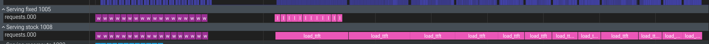
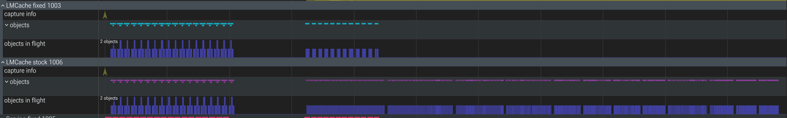
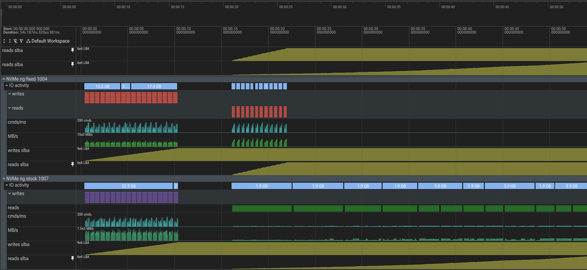

The QD~1 KV-load bottleneck found with eBPF, fixed with parallel loads
======================================================================

.. note::

   A styled standalone version of this page (identical content, dark
   theme) is served at `/showcase/kvio-loadpath.html </showcase/kvio-loadpath.html>`__
   and via htmlpreview from the repository's ``docs/kvio-loadpath.html``.

On a real 11.3 GB/s Gen5 NVMe, LMCache's ``raw_block`` KV-cache loader ran at **~1.2 GB/s — about 11% of the device**. The eBPF NVMe record shows why: reads were issued one 128 KiB command at a time, single-threaded, queue depth ~1. A one-file change that issues several objects' reads at once recovers **~2.8×**, and — because KV-load time is what the compute-vs-load crossover turns on — it moves that crossover toward smaller models.

**rig:** 8× H100, Samsung Gen5 NVMe, Linux 6.17 **tracer:** eBPF ``nvme_uring_cmd_monitor`` **engine:** LMCache ``raw_block`` io_uring_cmd **fix:** ``raw-block-parallel-load`` @ ``1dafbb31`` **status:** prototype-validated — more testing pending `← kvio main page <kvio.html>`__

The symptom
-----------

LMCache offloads LLM KV cache to raw NVMe (the ``raw_block`` engine, io_uring_cmd passthrough on ``/dev/ng``). Each KV object is a large blob — 8–20 MiB per rank — split into 128 KiB device commands. Loading it back should be near sequential-read speed. It wasn't.

**ioKV load, real TP4**

~1.2GB/s

70B TP4, 4640 MiB per request over io_uring_cmd on ``/dev/ng1n1``

**fiodevice ceiling**

11.3GB/s

same drive, 128 KiB sequential read, ``ioengine=io_uring``

**%device utilized**

~11%

the loader left ~90% of the drive on the floor

The device is not the bottleneck — the software path is. The only way to know that for sure is to look at the actual NVMe commands on the wire.

The wire evidence
-----------------

The eBPF tracer ``nvme_uring_cmd_monitor`` records every NVMe command on the io_uring_cmd path — opcode, LBA, byte count, the issuing thread, the io_uring ``user_data``, and a nanosecond timestamp. Replaying a real 70B/TP4 load and reading the trace back:

**serial** **72,960 read commands, all from one process / one kernel thread.** ``max concurrent in-flight objects = 1``; consecutive commands belong to the same object 99.4% of the time. Each 20 MiB object's 160 reads fire back-to-back, then the next object starts — nothing overlaps.

**QD~1 within an object too** The 160 commands of a single object are submitted with a **~83 µs gap** between consecutive submissions, while the device completes a 128 KiB read in ~16 µs. It is submit-one, wait, submit-next — ~80% of every command is software round-trip, not device time.

**the knob doesn't help** The engine is configured ``iouring_queue_depth=8``, but raising it to 64 changes nothing — the serial single-object number stays ~1.4 GB/s. The ring's queue depth is never used to pipeline the many non-overlapping reads of one object.

The trace also carries the LMCache ``trace_id`` in the high 32 bits of ``user_data``, so every command is attributed back to the KV object (and TP rank) that caused it — that join is what makes this a precise measurement rather than an aggregate guess.

Why this matters — the crossover turns on it
--------------------------------------------

Whether it is cheaper to *reload* a prefix's KV from storage or to *recompute* it on the GPU is a live question in LLM serving. With TP held fixed at 4, and load time set purely by the (crippled) ~1.2 GB/s path, the balance decomposes cleanly:

+---------------+---------------+-----------+----------------------+--------------+----------------------+
| model (TP4)   | GPU recompute | NVMe load | R = load ÷ recompute | per-rank obj | aggregate KV / chunk |
+===============+===============+===========+======================+==============+======================+
| Llama-3.1-8B  | ~0.38 s       | ~1.82 s   | ~4.8×                | 8 MiB        | 32 MiB               |
+---------------+---------------+-----------+----------------------+--------------+----------------------+
| Llama-3.1-70B | ~1.90 s       | ~4.13 s   | ~2.2×                | 20 MiB       | 80 MiB (×2.50)       |
+---------------+---------------+-----------+----------------------+--------------+----------------------+

Load time ≈ ``aggregate_bytes ÷ 1.2 GB/s``, so it grows with KV bytes (×2.27), while recompute grows with compute (×5.0). R improves ×2.2 at fixed TP4 — a real model-scale effect, isolated from TP. **But that load number is a fixable software floor, not storage physics.** Speed the loader up and R falls with it — the crossover moves toward smaller models.

**connector-gated** Prior work that finds "loading loses" is partly measuring QD~1, DRAM-bouncing loaders. A properly-pipelined loader changes the answer — which is exactly what the fix below starts to show.

Reproduce it
------------

All three steps run on any box with an NVMe char device (``/dev/ngXnY``) and the LMCache ``raw_block`` engine built. No GPU or model needed — storage geometry is content-independent.

1 · Build the eBPF tracer
~~~~~~~~~~~~~~~~~~~~~~~~~

::

   ebpf-syscall# in the ebpf-syscall tree; needs clang + libbpf-dev + bpftool
   make LIBBPF_SYSTEM=yes nvme_uring_cmd_monitor

2 · Measure the load path under varying concurrency
~~~~~~~~~~~~~~~~~~~~~~~~~~~~~~~~~~~~~~~~~~~~~~~~~~~

::

   kvio_parallel_probe.py# stores 128 × 20 MiB objects, then loads them back at W = 1,2,4,8,16,32
   KVIO_SRC=~/LMCache python kvio_parallel_probe.py \
       --device /dev/ng1n1 --obj-mib 20 --nobj 128 \
       --workers 1,2,4,8,16,32 --qd 8

3 · Confirm the wire behavior
~~~~~~~~~~~~~~~~~~~~~~~~~~~~~

::

   analyze_load_path.py# run the tracer around a load, then attribute commands to objects/ranks
   sudo nvme_uring_cmd_monitor --jsonl trace.jsonl --lba-size 4096 &
   # ... issue the load ...
   python analyze_load_path.py trace.jsonl sem.jsonl   # prints TIDs, in-flight objects, per-cmd gap

**probe result — real NVMe** A trivial Python thread-pool across *objects* (no engine change) already lifts the load path well off its serial floor:

================== ======= ========= =======================
load concurrency   GB/s    vs serial note
================== ======= ========= =======================
1 — serial (today) 1.9     1.0×      the shipped behavior
4 workers          2.9     1.5×      
8 workers          5.3     2.8×      best
16 workers         4.8–5.5 2.6×      plateau ≈ 44% of device
32 workers         3.8     2.0×      contention
================== ======= ========= =======================

The fix
-------

The per-object read already released the engine lock before doing I/O, and the Rust io_uring binding drops the GIL during the wait — so the objects of one batched load can simply be issued concurrently. The change factors the per-object body into ``_load_one_into`` and dispatches it over an optional pool sized by a new ``RawBlockCoreConfig.load_parallelism`` (default 1 = unchanged). The L2 adapter passes its *existing* ``num_load_workers`` (default 4) through, so a knob that previously only sized dispatch threads now actually parallelizes the read loop.

::

   load_many_into — before → after# before: one object at a time, each read awaited before the next
   for i, (key, entry) in enumerate(items):
       self._read_buffers([entry.offset + header], [buf], [len], [total])   # QD~1

   # after: issue several objects' reads at once over the load pool
   if self._load_pool and len(pending) > 1:
       futures = [self._load_pool.submit(self._load_one_into, i, key, entry, objs, results, roe)
                  for (i, key, entry) in pending]
       for f in futures: f.result()

**Δthe change**

2 files, ~120 lines. ``load_parallelism`` config (default 1, no behavior change unless opted in); adapter wires ``num_load_workers`` → ``load_parallelism``. LMCache branch ``raw-block-parallel-load``, commit ``1dafbb31``.

**✓why it's safe**

Each read touches only its own ``results[i]``/``objs[i]``; the index lookup holds the lock only briefly and releases it before I/O; the binding drops the GIL in the wait. Concurrency proven on real NVMe (the 2.8× probe above).

**the payoff** ~2.8× on the NVMe leg flips the 70B/TP4 balance: load 4.13 s → ~1.5 s vs recompute ~1.9 s ⇒ **R ≈ 0.78 — loading wins**; and 8B/TP4 comes into range. The crossover is a connector problem, not a storage limit.

End to end, in a live serving stack
-----------------------------------

The numbers above are the storage leg. The open question was whether it moves *user-facing* TTFT once the DRAM→GPU copy, the connector, and scheduling join the path. Measured on a real ``vllm serve`` Llama-3.1-8B + LMCache MP stack, raw_block L2 on NVMe passthrough, KV resident on the device — it does.

**TTFTC=1**

4.0× faster

p50 3154 → 779 ms

**tputC=4**

5.0× higher

0.52 → 2.60 req/s

**cachehit rate**

47→83%

slow loads stop timing out into recompute

Default connector config (``mq_timeout=10s``, recompute fallback on) — what a user sees:

============== =============== ========== =======
metric         baseline (QD~1) batched    speedup
============== =============== ========== =======
C=1 TTFT p50   3154 ms         779 ms     4.0×
C=1 TTFT p99   3960 ms         813 ms     4.9×
C=4 TTFT p50   7008 ms         1476 ms    4.7×
C=4 throughput 0.52 req/s      2.60 req/s 5.0×
============== =============== ========== =======

With recompute rescue disabled (``mq_timeout=90s``) the isolated storage penalty is unmasked:

============ =============== ======= =======
metric       baseline (QD~1) batched speedup
============ =============== ======= =======
C=1 TTFT p50 11885 ms        763 ms  15.6×
C=4 TTFT p50 20248 ms        1375 ms 14.7×
============ =============== ======= =======

Batched TTFT is stable across both (779 → 763 ms) — it loads fast enough to never hit the timeout. Baseline swings 3154 → 11885 ms with the timeout, proving its slowness *is* the QD~1 load.

**which fix** This measured the **batched within-object read** (commit ``ec0a6a58``) on top of the io_uring worker **no-hang** fix (``b839153b``). The cross-object ``load_parallelism`` pool of §05 (``1dafbb31``) is complementary and not yet measured end to end.

Why a naive serving A/B lies — four confounds
~~~~~~~~~~~~~~~~~~~~~~~~~~~~~~~~~~~~~~~~~~~~~

Each of these silently collapses the two arms to *equal*; each had to be instrumented out. Skip the guards and you "measure" no difference and wrongly conclude the fix does nothing.

**L1 cache dilution**

First load promotes KV to the DRAM tier; repeats hit L1, not raw_block. → N distinct prefixes, working set ≫ L1, round-robin. *Guard:* tier shows ``0 L1``.

**pool starvation**

``eviction-policy noop`` + small L1 starves the staging pool → allocs fail → silent recompute. → ``LRU`` + pool sized for staging. *Guard:* 0 alloc failures.

**recompute masking**

At low ``mq_timeout`` slow loads abandon to GPU recompute, capping baseline TTFT. → sweep ``mq_timeout``. *Guard:* external hit rate.

**iostat blindness**

Block-layer counters don't see io_uring_cmd passthrough — they read ~0 under load. → NVMe controller ``Data Units Read``. *Guard:* device GB read.

**the payoff** The QD~1 fix is not a microbench curiosity: 4× lower TTFT and 5× throughput on a normal 8B serving load, and the cache stays useful (83% vs 47% hit rate) instead of thrashing into recompute.

See it — the crossover on one timeline
--------------------------------------

Everything above is also a *picture*. The crossover measurements were captured with the full kvio tracing stack (eBPF device completions + schema-2 semantic trace + serving spans) and converted to Perfetto timelines (`how-to <kvio-perfetto.html>`__). Below: the 8B cell — the crossover point — with the **stock** (QD~1) and **fixed** (batched) arms stacked. Same 18-prompt warm phase, same bytes, same drive; the only variable is the load path.

   **Request layer.** Warm phases (w) are identical twins; then the measured requests diverge — fixed’s TTFTs are slim ticks (~490 ms), stock’s are the fat load_ttft bars (~2.4 s each) stretching to the end of the capture.

   **KV-object layer.** Each request fans into ~58 object loads. Fixed’s objects are brief ticks; stock’s are long dashes — and the objects in flight counter shows stock grinding one-object-at-a-time for the whole tail of the timeline.

   **Device layer — where the DMA lives.** The IO activity summary rows tell the whole story in one line each: identical ~33 GB warm writes, then fixed drains its reads in one dense ~8 s burst while stock crawls — each pale span in stock’s tail is *one request’s ~1.9 GB of KV* trickling off the drive at QD~1. During every one of those spans the GPU is idle and the NVMe controller is doing all the work by DMA; the fix doesn’t change what moves, only how hard the device is allowed to work. MB/s, cmds/ms and the slba space-axis ramps confirm: same bytes, same layout, 5–7× the wall time.

**explore it yourself** The timelines behind these screenshots (plus the 70B load-wins-4.4× cell and a same-drive io_uring vs cuFile vs OpenDS DMA-transport trace) are in the evidence bundle as .pftrace.gz files — drag any of them onto `ui.perfetto.dev <https://ui.perfetto.dev>`__ (processing is local to your browser).

What’s left — honest status
---------------------------

**still open** The end-to-end serving win above is the **batched within-object** fix; the cross-object ``load_parallelism`` pool (§05) is validated only on the NVMe→DRAM leg (the 2.8× probe) and not yet inside a live serving run. Neither result yet isolates the DRAM→GPU copy or the all-rank-ready barrier.

- **Single-ring ceiling (~5 GB/s, ~44% of device).** eBPF shows the thread-pool still funnels through one submitter; the per-command gap only drops 83 → 54 µs. Reaching device bandwidth needs multiple io_uring rings (true multi-submitter), or intra-object pipelining in the engine — a follow-up prototype.
- **Skip the DRAM bounce entirely.** The real endgame is NVMe→GPU DMA (GPUDirect Storage / cuFile, or io_uring into a GPU dma-buf), which removes both the software round-trips and the host-memory copy the probe didn't even count.
- **Storage must scale with TP.** Per-rank objects are 1/TP the size, but the aggregate crossing one shared drive is constant — so the "storage scales with GPUs" case (per-rank drives / striping) is the decisive test for a production crossover claim.
- **Frontier caveat.** MLA models (DeepSeek-class) replicate KV per rank, so aggregate offload bytes grow ×TP — offload may never cross on a shared tier there.

kvio case study — the QD~1 KV-load bottleneck tracer: eBPF ``nvme_uring_cmd_monitor`` · engine: LMCache ``raw_block`` · fix: ``1dafbb31``
